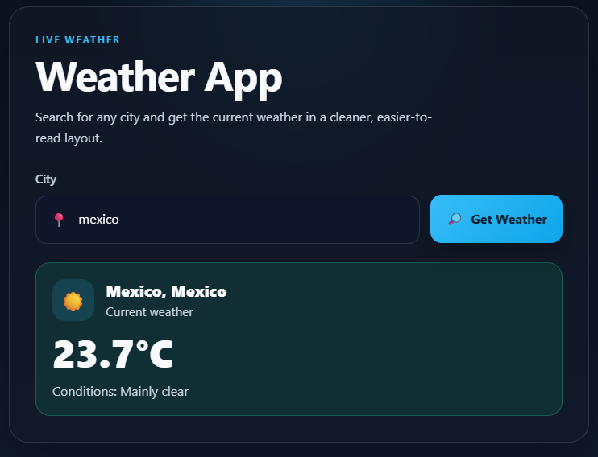

# Weather App




## 📑 Table of Contents

- [Project Summary](#project-summary)
- [Development Context](#development-context)
- [Features](#features)
- [UI / UX Improvements](#ui--ux-improvements)
- [Architecture](#architecture)
- [Project Structure](#project-structure)
- [Installation Instructions](#installation-instructions)
- [User Guide](#user-guide)
- [Sample Results](#sample-results)
- [Error Handling](#error-handling)
- [API Information](#api-information)
- [Testing](#testing)
- [Privacy and Data Handling](#privacy-and-data-handling)
- [Licensing and Third-Party Tools](#licensing-and-third-party-tools)
- [Future Improvements](#future-improvements)

## Project Summary

Weather App is a modern, lightweight client-side web application that displays current weather data for any city entered by the user.

It features a clean, responsive UI with improved readability, loading states, and visual feedback, while using Open-Meteo APIs without requiring an API key.

## Development Context

This project was developed as part of the **"AI Training for Software Developer"** course.

The main objective of the course was to learn how to build web applications using AI as a development tool, integrating it into tasks such as:

- Code generation and refactoring
- Debugging and error handling
- UI/UX improvements
- Documentation and testing

This project reflects an AI-assisted development workflow, combining human decision-making with AI-generated suggestions to improve productivity and code quality.

## Features

- Search weather by city name
- Clean and responsive UI (mobile-first design)
- Visual weather display with icons and structured layout
- Loading state with spinner feedback
- Error and success states with clear styling
- Keyboard support (Enter key submission)
- Weather description mapping from weather codes
- In-memory and localStorage caching for performance
- Modular JavaScript architecture (ES modules)
- Includes Jest unit tests for weather fetching and error handling

## UI / UX Improvements

- Redesigned layout using a card-based interface
- Improved typography, spacing, and color contrast
- Responsive layout for mobile and desktop
- Integrated weather icons for better visual feedback
- Accessible states using aria attributes (aria-live, aria-busy)
- Smooth loading and interaction feedback

## Architecture

- `js/main.js`: Handles user interaction and app flow
- `js/main.test.js`: Contains Jest unit tests that validate the weather app behavior
- `js/ui.js`: Responsible for rendering UI states and results
- `js/weather.js`: Handles business logic, API integration, and caching
- `js/api.js`: Fetch abstraction layer
- `js/utils.js`: Input validation utilities
- `css/style.css`: Styling and responsive design
- `index.html`: Main HTML structure

This separation ensures maintainability and scalability.

## Project Structure

```bash
weather-app/
│
├── index.html
├── css/
│   └── style.css
├── js/
│   ├── main.js
│   ├── main.test.js
│   ├── ui.js
│   ├── weather.js
│   ├── api.js
│   └── utils.js
├── assets/
│   ├── img/
│   └── icons/
├── LICENSE
├── package-lock.json
├── package.json
└── README.md
```

## Installation Instructions

1. Clone or download the repository.
   ```bash
      git clone https://github.com/JetsaelVillegasMendoza/weather-app.git
   ```
2. Navigate the project folder.
   ```bash
      cd weather-app
   ```
3. Install dependencies for tests:

   ```bash
   npm install
   ```

4. Open `index.html` in your browser (recommended with Live Server).

> Note: The app uses ES modules (`type: module` in `package.json`), so the browser must support module scripts when opening `index.html`.

## User Guide

1. Open `index.html` in a browser.
2. Enter a city name in the input field.
3. Click the **Get Weather** button or press **Enter**.
4. The weather result appears below the input.

> Example: enter `Paris`, then click **Get Weather**.

## Sample Results

Successful result example:

```text
Paris, France
Temperature: 18°C
Conditions: Clear sky
```

Error examples:

```text
Please enter a city name.
```

```text
City not found
```

## Error Handling

The application handles errors at several stages:

- Empty or invalid city input is rejected with a message.
- If the geocoding API does not find the city, the user sees `City not found`.
- If the API request fails or returns invalid data, the app shows an appropriate error.
- If location coordinates or current weather are missing, the app reports the issue.
- Unknown weather codes are shown as `Unknown weather`.

## API Information

The app uses the following Open-Meteo APIs:

- Geocoding: `https://geocoding-api.open-meteo.com/v1/search?name={city}&count=1`
- Forecast: `https://api.open-meteo.com/v1/forecast?latitude={lat}&longitude={lon}&current_weather=true`

No API key is required for these endpoints.

## Testing

Run unit tests with:

```bash
npm test
```

The suite uses Jest and runs with node experimental VM modules to support ES module imports.

## Privacy and Data Handling

This application does not require user accounts, passwords, or API keys.

It does not use browser geolocation in its current version. Weather searches are based only on the city name entered manually by the user.

To improve performance, the app stores recent weather responses in localStorage for up to one hour using geographic coordinates associated with the searched city. This cache is used only on the client side and is not sent to any custom backend server.

If stronger privacy is required, the caching strategy can be changed to in-memory storage only, avoiding persistence between sessions.

## Licensing and Third-Party Tools

This project is released under the MIT License.

Third-party tools and services used in this project include:

- **Open-Meteo API** for geocoding and weather data
- **Jest** for unit testing
- **jsdom** through `jest-environment-jsdom` for DOM-related test execution

Each dependency keeps its own respective license. See `package.json`, `package-lock.json`, and the `LICENSE` file for project and dependency details.

## Future Improvements

- Add hourly and 7-day forecast
- Dynamic background based on weather conditions
- Geolocation support (detect user's current location)
- Favorite cities and persistent search history
- Dark/light theme toggle
- API request retry and offline handling
